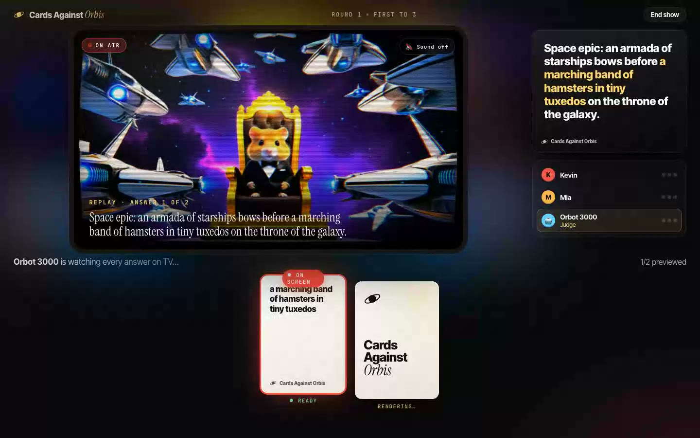

# Cards Against Orbis

**The party card game where the winning card comes to life as live AI video.**



Fill in the blank like any late-night card game. Then the big screen, styled as
a live TV broadcast, _tunes in to each answer_: Orbis renders every answer as its
own live scene, and the judge flips between them instantly before crowning one.
The winning world keeps running on air while the next round starts.

Play it: **https://cards.bidslop.com**

Built for the
[Visko Orbis Online Challenge, September 2026](https://www.visko.ai/challenge/orbis-september-2026)
on [Orbis Stable](https://www.reactor.inc/models/visko-orbis-stable/api).

## How it plays

1. 3 to 8 players share one screen (laptop or TV). Bots can fill seats, so you
   can play alone with two bots.
2. Each round one player is the **judge**. A black card sets a scene:
   _"Wedding video: the guests gasp as the bride walks down the aisle arm in arm
   with \_\_\_\_."_
3. Everyone else plays a white card from a hand of 7. The screen hides each hand
   until the right player taps "Show my cards", so you pass the device around.
   **Write-your-own** blank cards let you type anything, and it becomes video.
4. **Live judging.** Answers arrive face down. The TV changes channel to each
   answer in turn while Orbis renders it live, and each one is recorded as it
   airs. Flipping a card then replays that answer instantly, so the judge can
   compare every option before crowning one.
5. **The reveal.** Confetti, a point, and the winning scene keeps playing.
6. First to 3, 5 or 7 points wins. The finale shows **the reel**: a clip of every
   winning scene, plus a download of the full episode.

## Why Orbis is the game, not a gimmick

- **Judging is real-time interaction.** Every answer becomes its own live Orbis
  scene. The judge watches each one air, then flips between instant replays.
  Without real-time generation, this mechanic cannot exist.
- **A new world per answer.** Each scene is a hard cut to a fresh Orbis run, so
  every answer gets its own universe instead of a morph of the last one.
- **It looks like TV on purpose.** The whole game is a late-night game show, so
  a WebGL shader draws the stream as a glowing CRT broadcast: full color,
  curved glass, scanlines. Every scene change is a channel flip with static,
  which also covers the seconds while Orbis starts the new scene.
- **The winner stays on air.** The winning scene keeps running while players
  pick their next cards. The finale reel replays every winning scene.
- **Warm-up is hidden in play.** The studio connects when the game starts, so
  the model boots while players pick their first cards. If Orbis is at
  capacity, the app retries on its own.

## Run it

Needs Node 22+, pnpm, and a Reactor API key from [reactor.inc](https://reactor.inc).

```bash
cp .env.example .env.local
```

Put your key in `.env.local` as `REACTOR_API_KEY=...`, then:

```bash
pnpm install
```

```bash
pnpm dev
```

Open http://localhost:3000, add players (or bots), and press **Open the studio**.
The first boot of the model can take a minute; play cards while it warms up.

## How it works

| Piece                        | What it does                                                                                                                                                                                                                                                                            |
| ---------------------------- | --------------------------------------------------------------------------------------------------------------------------------------------------------------------------------------------------------------------------------------------------------------------------------------- |
| `lib/game.ts`                | Pure game rules: deal, play, judge rotation, crown, bots, write-in cards. Tested with `pnpm test`.                                                                                                                                                                                      |
| `lib/cards.ts`               | 45 black and 150 white original cards, written to make strong pictures (places, camera setups, creatures, chaos), not text-only jokes.                                                                                                                                                  |
| `hooks/use-orbis-session.ts` | `show(prompt)`: a hard cut to a new world (`reset` → `set_prompt` → wait for `conditions_ready` → `start`). Fast changes coalesce to the latest prompt. `record(seconds)` records the live track in the browser (MediaRecorder) for instant replays. Restarts the run if Orbis ends it. |
| `components/tube.tsx`        | WebGL shader that draws any `<video>` (the live stream or a recorded replay) as a CRT broadcast: barrel curve, RGB fringe, scanlines, glow, and channel-flip static while a new scene tunes in.                                                                                         |
| `components/game.tsx`        | The studio UI: live stage with ambient glow, chyron captions, hands, flip-to-preview judging, reveal, finale reel.                                                                                                                                                                      |
| `app/api/token/route.ts`     | Exchanges the server-side API key for a short-lived, single-session JWT. The key never reaches the browser.                                                                                                                                                                             |

Stack: Next.js 16, React 19, `@reactor-team/js-sdk`, Motion, canvas-confetti.
